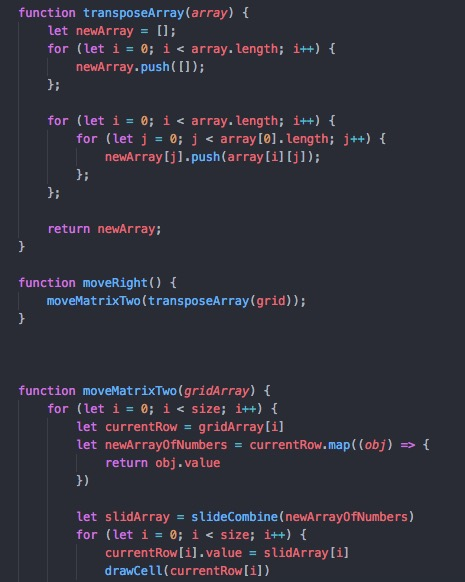

# 2048 

## Project
Include at least one CSS animation/transition fired by a DOM event
See details in CSS
use css animation when two of the same blocks collide
more animation when new block appears 
Use flexbox or CSS grid for layout and positioning
grid 4 by 4 using CSS grid 
A description of the game you'll be building with the objective described in non-technical language.
This game 2048 is a grid game where the player must reach the highest number of 2048 in order to win.

## Description 

The player starts with two tiles that are randomly generated and placed on the grid. Both of these tiles will be the number 2. 

The player is then allowed to move left right up or down. Each turn will result in a new tile being randomly placed on the board.  If two of the same number collide then they will merge together and generate a new tile that will be the sum of those two numbers. 

## Technologies used
Need to select the 4 keys that the player will use using eventListener 
CSS styling for the grid
CSS animation for generating of new tiles and when tiles collide
JS function, objects and arrays
Collision Detection 

## major problems 
Having the tiles add together when they collide.
Animating the random new tiles
Having the tiles of different values be different colors
Declaring a winner. 
and many more …

## Solving the aforementioned problems.
having the event listener react with the CSS and have the background color change 
When the random grid location is generated having it trigger an animation outlined in the CSS

	•	A link to your live game deployed on GitHub Pages
	•	An explanations of the technologies used
	•	Select wireframes
	•	Additional information including but not limited to - the approach taken, installation instructions, unsolved problems, e
	
This project is available at (https://twentyfoureight.surge.sh)

